<a href="https://apps.apple.com/us/app/spawn/id6738635871?itscg=30200&itsct=apps_box_badge&mttnsubad=6738635871">
		
</a>
<a href="https://apps.apple.com/us/app/spawn/id6738635871?itscg=30200&itsct=apps_box_badge&mttnsubad=6738635871">
  
</a>

<a href="https://apps.apple.com/us/app/spawn/id6738635871?itscg=30200&itsct=apps_box_badge&mttnsubad=6738635871"></a>
<a href="https://apps.apple.com/us/app/spawn/id6738635871?itscg=30200&itsct=apps_box_badge&mttnsubad=6738635871">


## Links

- [Back-End Repository](https://github.com/Daggerpov/Spawn-App-Back-End)
- [Swift Learning Resources](https://danielagapov.notion.site/Coding-Learning-Resources-5e2294e8ffa342b0bd103aafee808f99#12edfd4fb3e380a5b6dee6d78a2c67dd:~:text=File%20Structure-,Swift,-Basics)
- [SwiftUI Learning Resources](https://danielagapov.notion.site/Coding-Learning-Resources-5e2294e8ffa342b0bd103aafee808f99#12edfd4fb3e380a5b6dee6d78a2c67dd)


## Setup

<details>

<summary> Running the app (iOS Simulator & XCode Canvas) </summary>

</br>

## 1. iPhone Simulator (for end-to-end testing)

<!-- 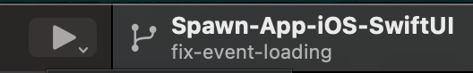-->

## 2. Previewing within XCode (for quickly seeing UI changes)

Firstly, in `MockAPIService.swift` is where you'll be able to dictate whether the app is being mocked, through the `isMocked` variable, as you can see here:
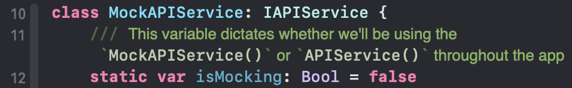
This should be set to `true` if you're working on a UI-specific feature that will be previewed within XCode often for making UI tweaks.

On that topic, to preview within XCode, you can toggle that through toggling "Edit" -> "Canvas"

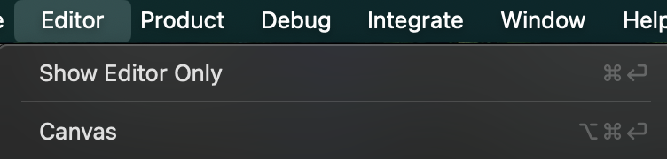

However, you'll only be able to preview SwiftUI files that include this section here (typically at the bottom of the file):

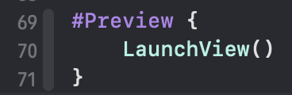

More complicated case, to supply initial state and `init()` parameters:

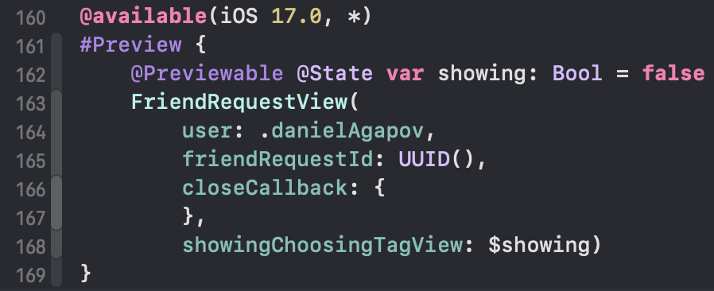

</details>

</br>

# iOS/Swift Code Explanations

<details>

<summary> API Calls </summary>

</br>

### API Calls

- In our codebase, we do these API calls from within `ViewModel`s, which leverage the `IAPIService` interface methods, implemented in `APIService.swift` and implemented as mocks in `MockAPIService.swift`
    - An example of this is here:
    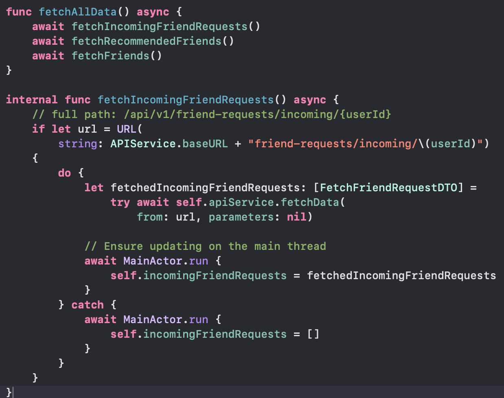
    - As you can see, the method is marked `async`
    - It interfaces with our [back-end API](https://github.com/Daggerpov/Spawn-App-Back-End), as the URLs match up with our endpoints in the back-end `Controllers/` directory
        - The URL is concatenated with our back-end's base URL defined here:
        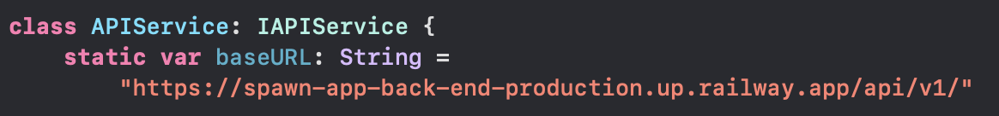
    - We surround all code with a `do-catch`, similar to other languages' `try-catch` blocks.
- `APIService.swift`
    - This makes actual GET, POST, PUT, and DELETE requests to our back-end API
        - Additionally, there's a special `createUser()` method, since that request also takes in raw image data for the user's profile picture
    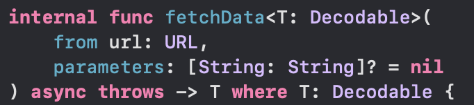
    - `Decodable` and `Encodable` are used to serialize and deserialize JSON data, so we need our `Models/` classes to conform (implement) these protocols
        - `Codable` makes them conform to both:
        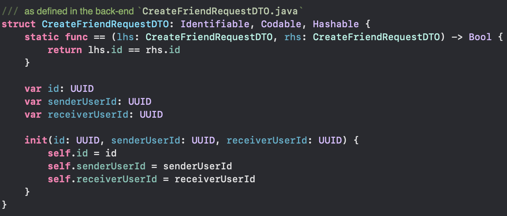
    - The `parameters` argument is used for argument parameters, like in a URL as you'd see `/events?requestingUserId=1` for example -> we then construct a `finalURL`
    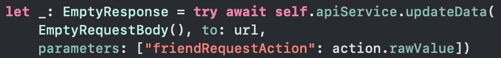
    - The `URLSession.shared.dataTask` method is used to make the actual request
    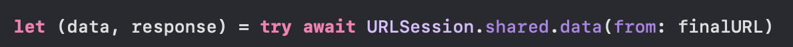
    - Then, we `handleAuthTokens()` to deal with JWTs (JSON Web Tokens) sent from the back-end, which comprises the access token and refresh token
        - This stores those tokens in the Keychain, on the user's device, for future requests
        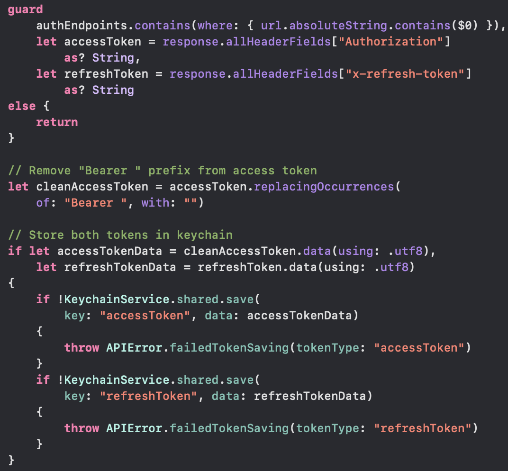
    - Afterward, we ensure:
        - The status code is what we expect, like 204 for a successful DELETE request or 200 for a successful GET request
        - The data can be decoded into what we expect, like a `User` object for a GET request to `/users/1`
        - If there's an error in any capacity, we throw it so that the calling `ViewModel` class can catch it and deal with it through UI or state updates accordingly
    
- `MockAPIService.swift`
    - This is where we define the mocked data that we use for testing purposes, when the `isMocked` variable is set to `true` in `MockAPIService.swift`
    - We do this by matching up the requested URL with its requesting data type in a `return` as such:
    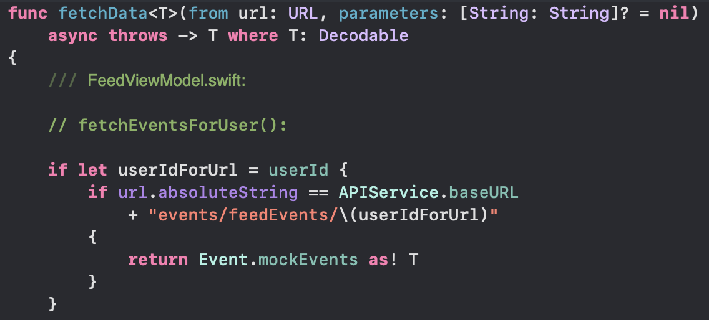

</details>

<details>

<summary> Asynchrony in SwiftUI </summary>

</br>

### Asynchrony in SwiftUI

- `onAppear{}` is a way to run a function when a view appears
    - This is similar to React's `useEffect()` hook
    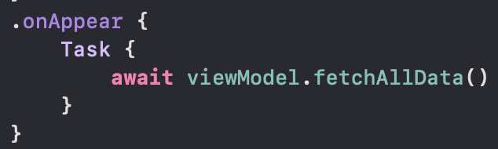
- The `Task{}` closure, is a way to run an asynchronous functions in SwiftUI
    - This ensures that this piece of code is ran asynchronously, and that the UI is not blocked on the main thread, since anything in `Task{}` runs on the background thread.
- `MainActor.run{}` is a way to run a function on the main thread, and is used to update the UI
    - This is similar to React's `setState()` method
    - This is essentially the inverse of `Task{}` in that it runs on the main thread, and is used to update the UI, from within a background thread
    - One application would be when you're fetching data from within a ViewModel class (which is on a background thread), and you want to update the UI with that data, you would use `MainActor.run{}` to update the UI with that data
    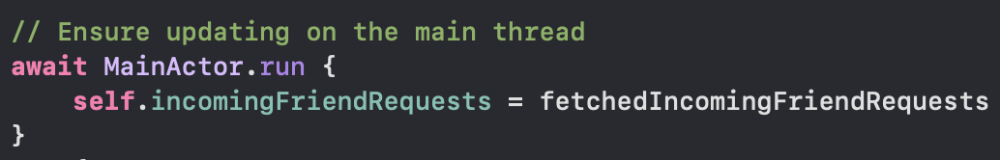

</details>

<details>

<summary>SwiftUI Syntax</summary>

</br>

# SwiftUI Syntax

- `@State` is a mutable variable, and works similarly to React state variables, except without `setState()` methods
    - `@Binding` is a way to pass a `@State` variable from a parent view to a child view
- `@ObservedObject` is a way to observe changes in an object, and is used for observing changes in a `ViewModel` object
    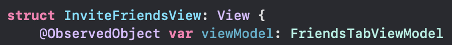
    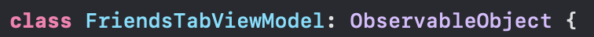
    - `@Published` is a way to publish changes in a variable, and is used for publishing changes in a `ViewModel` object
        - This will work similarly to `@State`, except that it will be used in a `ViewModel` object, and published to a parent view through `@ObservedObject`
        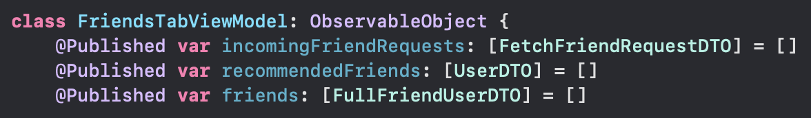
- `var body: some View{}` is the main body of a SwiftUI view, and is where the UI is defined
    - This is similar to React's return statement in a functional component
- `HStack`, `VStack`, and `ZStack` are ways to group components (like divs in HTML) across dimensions: horizontally, vertically, and in the Z-dimension
    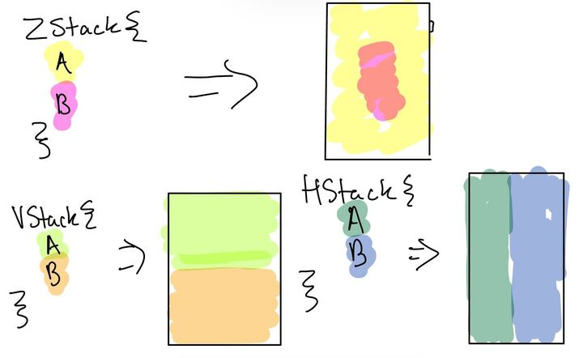
- `Button{}` is a way to create a button in SwiftUI
    - the action parameter is where you define what happens when the button is clicked
    - the other closure is the label closure, as such, which display the button's UI
    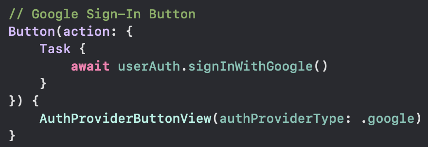
- `NavigationLink{}` is a way to navigate to another view in SwiftUI, as a button
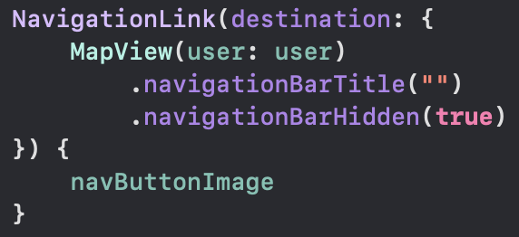
- Unwrapping Optionals (4 ways):

In this example, `app.users` is an optional value, a.k.a. it might be `nil` (`null` in other languages). Thus, we need to 'unwrap' it to get the actual value, and here are the 4 ways to do this in Swift:
```
let appUsers = appPortfolio.map {app in
		// Force-Unwrap
    return app.users! // leads to error if app.users is nil -> very dangerous
    
    // guard unwrap, for early-exits
    guard let userCount = app.users else {
        return 0
    }
    return userCount
    
    
    // if unwrap, for quick usage, but without persistence of guard
    if let userCount = app.users {
        return userCount
    } else {
        return 0
    }
    
    // nil coalescing to provide default value
    // example of good default would be "Not Given" for a user's username
    return app.users ?? 0
}
```

</details>

<details>
<summary>MVVM Architecture</summary>

### MVVM Architecture

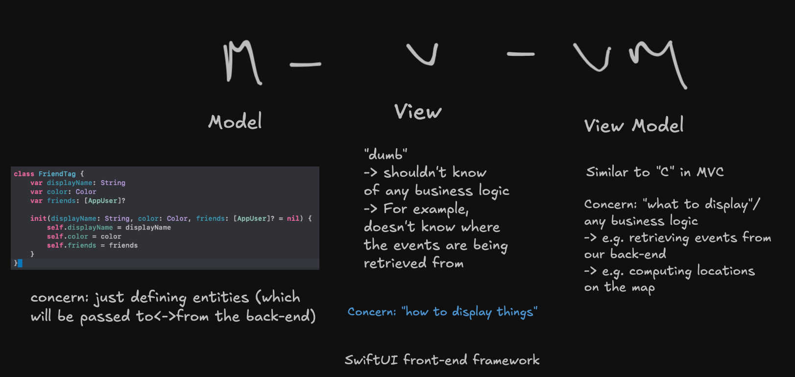

</details>
