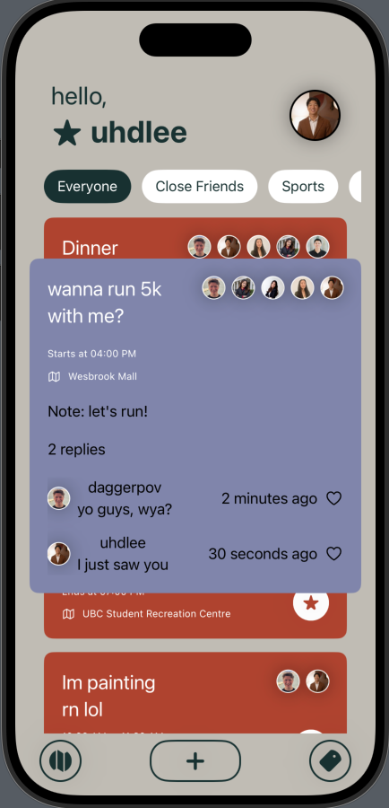

# Spawn-App-iOS-SwiftUI

This app idea originated at the UBC Biztech UX Open event, by Jennifer, Haley, Dhrishty, and Daniel Lee.

See the Figma Design Prototype [here](https://www.figma.com/design/ewushMunvsBWWpKbKnWsIH/UXOpen-Prototype?node-id=0-1&t=ggotcSV4tCqG3jVS-1).

Scroll down or see the Entity Relationship Diagram.
 
# Current App Look:

# Entity Relationship Diagram:

