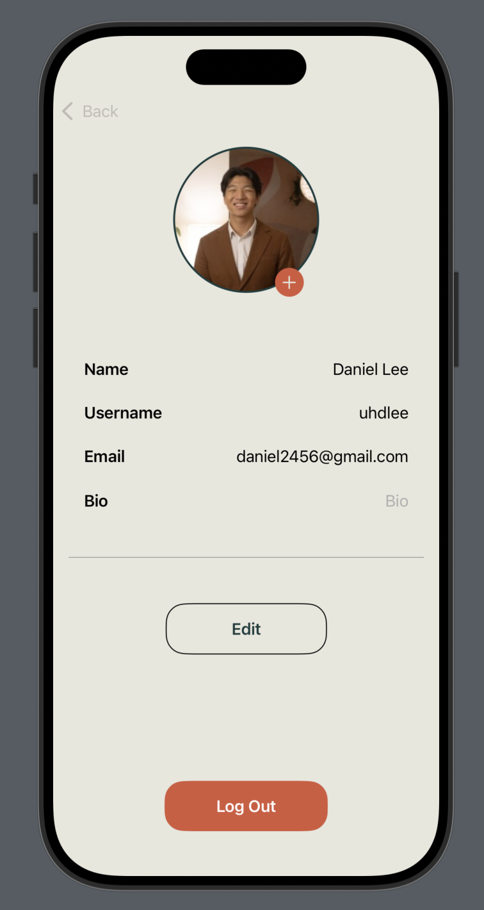

# Spawn-App-iOS-SwiftUI

Table of contents:
- [Onboarding](#onboarding)
- [Current App Look](#current-app-look)
    - [Legacy Screenshots](#legacy-screenshots)
- [Entity Relationship Diagram](#entity-relationship-diagram)
- [MVVM Architecture Explanation](#mvvm-architecture-explanation)

# Onboarding

## Ask Daniel for:

- Figma link
- TestFlight invite, to try the app on your own phone

## General Links

- [Back-End Repository](https://github.com/Daggerpov/Spawn-App-Back-End)
- [Swift Learning Resources](https://danielagapov.notion.site/Coding-Learning-Resources-5e2294e8ffa342b0bd103aafee808f99#12edfd4fb3e380a5b6dee6d78a2c67dd:~:text=File%20Structure-,Swift,-Basics)
- [SwiftUI Learning Resources](https://danielagapov.notion.site/Coding-Learning-Resources-5e2294e8ffa342b0bd103aafee808f99#12edfd4fb3e380a5b6dee6d78a2c67dd)
 
# Current App Look

Note that this is usually behind our actual 'current' app; stay tuned on [getspawn.com/]([url](https://getspawn.com/)) for our beta for the actual app

## Legacy Screenshots:

# Entity Relationship Diagram

# MVVM Architecture Explanation

