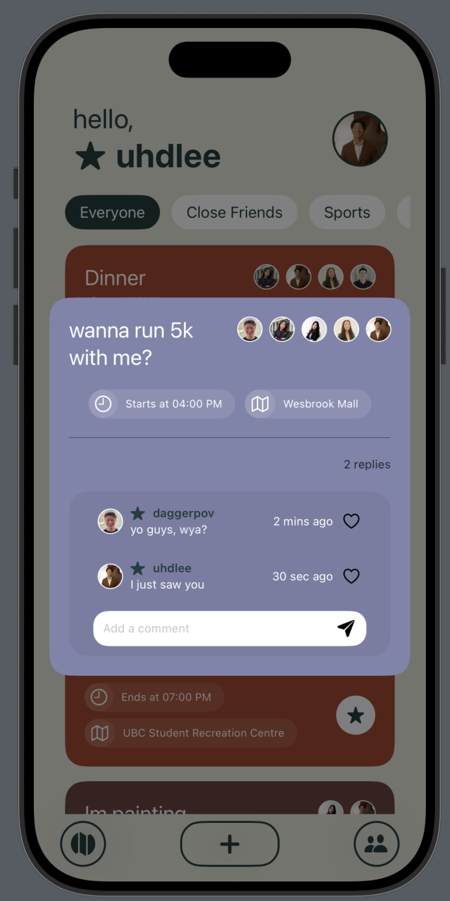

# Spawn-App-iOS-SwiftUI

See the Figma Design Prototype [here](https://www.figma.com/design/ewushMunvsBWWpKbKnWsIH/UXOpen-Prototype?node-id=0-1&t=ggotcSV4tCqG3jVS-1).

Table of contents:
- [Spawn-App-iOS-SwiftUI](#spawn-app-ios-swiftui)
- [Current App Look:](#current-app-look)
- [Entity Relationship Diagram:](#entity-relationship-diagram)

 
# Current App Look:

# Entity Relationship Diagram:

